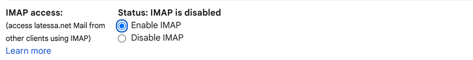
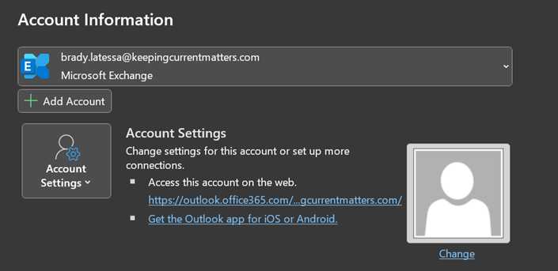
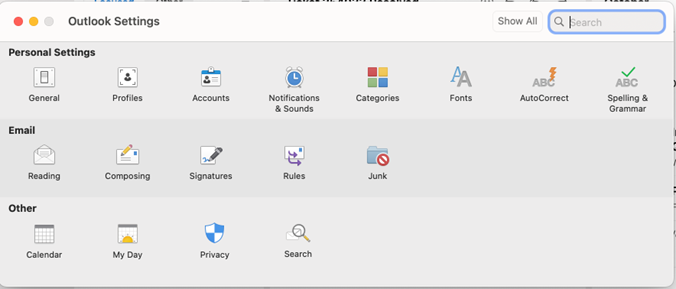
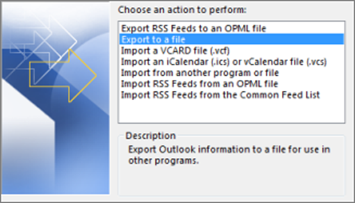
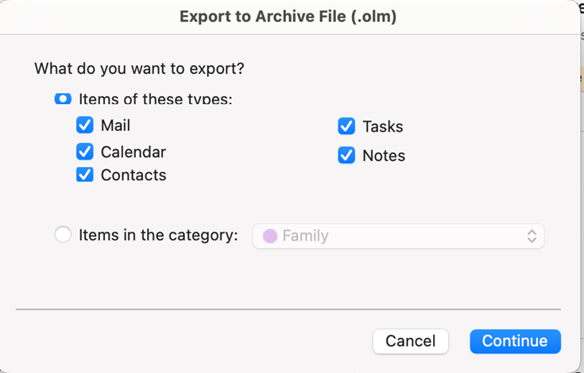
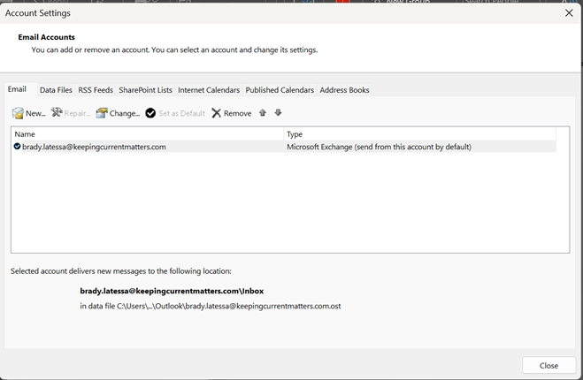
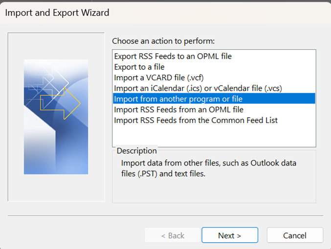
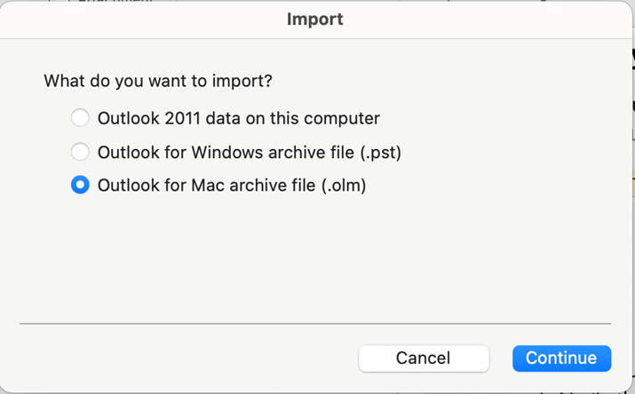

# Gmail Migration
!!! note

    If the Google account you are migrating is associated with your @keepingcurrentmatters.com email then you can skip this step.

## Prepare your Gmail account
#### 1. Turn on 2 factor authentication
   - Start by going to [https://myaccount.google.com/signinoptions/.two-step-verification/enroll-welcome](https://myaccount.google.com/signinoptions/two-step-verification/enroll-welcome).
   - Click **get started** and enter your password.
   - Follow the prompts to add your phone.

!!! info

    To learn more about 2 factor authentication go to [https://safety.google/authentication](https://safety.google/authentication/)

#### 2. Enable IMAP for Gmail
- Sign into [gmail.com](https://gmail.com) with the account you are attempting to migrate.
- Select the **gear icon** located at the top right of the screen.
- In the dropdown menu select **see all setings**.
- Switch to the **Forwarding and POP/IMAP** tab.
- Scroll down to **IMAP Access** and select **Enable IMAP**

## Migrate account
!!! warning

    You cannot use **New Outlook** to complete these steps.

### 1. Add your Google Account
=== "Windows"

    - Go to file and click add account.
    {: style="height:250px"}
    - Enter the email address for the Google account you're trying to migrate.
    - Outlook should automatically recognize this is a Google account and open a **Google Sign in Prompt**.
    - Allow the requested permissions.

=== "Mac"

    - Open outlook settings by ⌘+, or **Outlook** > **Settings**.
    {: style="height:250px"}
    - Go to **accounts**.
    - Add an account using the **+** symbol at the bottom.
    - Enter the email to the Google account you are migrating and click **continue**.
    - Outlook will automatically detect it is a Google account and open a **Google Sign in Prompt**.
    - Sign in and complete the 2fa procedure.
    - Allow the requesred permissions.

### 2. Export Archive
=== "Windows"

    - Go back to Outlook and select **file** > **Open & Export** > **Import/Export*.
    - Select **Export to File** then press **Next**.
    {: style="height:250px"}
    - Select **Outlook Data File (.pst)** and select **Next**.
    - Select the mail folder(s) you want to migrate and select **Next**.
    - Save the archive to your computer

=== "Mac"

    - Go back to the Outlook app and proceed to **file** > **export**.
    {: style="height:250px"}
    - Press **Contine** then save the archive on your computer.

### 3. Import Archive
=== "Windows"

    - Remove the Google account you added **file** > **account settings** > Select **account settings** from the dropdown menu.
    {: style="height:350px"}
    - Select the Google account and click **Remove**.
    - Go to **File** and press **Open & Export**.
    - Select **Import/Export**.
    - Select **import from another program or file** and press **Next**.
    {: style="height:250px"}
    - Select **Outlook Data File (.pst)** and Select **Next**.
    - Choose the arhive we saved earlier and press **Import**.

=== "Mac"

    - Import the archive into your @keepingcurrentmatters account **File** > **Import**
    {: style="height:250px"}
    - Select **.olm** and import the file you saved