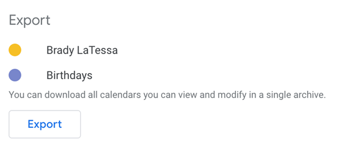

# Google Calendar Migration

#### 1. Export Google Calendar

- Go to [calendar.google.com](https://calendar.google.com).
- Select the **Gear** icon.
- In the dropdown select **Settings**.
- On the left sidebar find the **Import/Export** tab
- Select the **export** button
  {: style="height:250px"}

#### 2. Import Calendar to Outlook

- Open **Outlook**.
- Go to your calendar.
- Select **Add Calendar**. On Mac OS and Windows New Outlook it is on the left side of the list of calendars. On Windows legacy and Old Outlook it is in the top right toolbar
- From the dropdown select **Import ICS**. If your on Windows and struggling with this step watch this [video](https://support.microsoft.com/en-us/office/import-calendars-into-outlook-8e8364e1-400e-4c0f-a573-fe76b5a2d379)
- On your computer find the exported calendar(s) and select **Open**.
- Press **Import**
