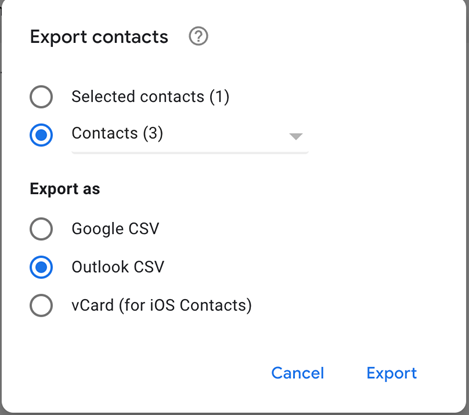
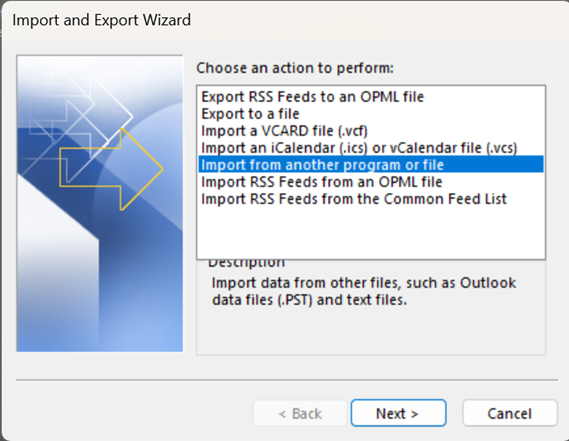
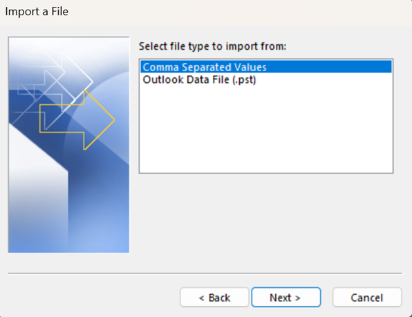
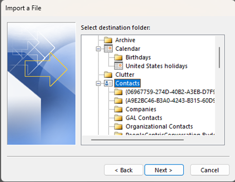

# Google Contacts Migration

!!! warning

    If you're on a Mac, then you must import your contacts during the Gmail migration process.

#### 1. Export Contacts

- Go to [contacts.google.com](https://contacts.google.com).
- Select the **up-arrow** icon beside the printer button.
- Select **export** from the dropdown.
- Select the **Contacts** option under Selected Contacts.
- Select **Outlook CSV**.

{: style="height:250px"}

- Select **Export**

#### 2. Import to Outlook

- Within Outlook go to **File** > **Open & Export**.
- Select **Import/Export**.
- Choose **Import from another program or file** and press **Next**.
  {: style="height:250px"}

- Choose **Comma Separated Values** and press **Next**  
  {: style="height:250px"}

- Find the file on your computer, set your duplication settings and press **Next**
- Find the **Contacts** folder in the file tree (if there is a specific folder you want the contacts in, feel free to do that).  
  {: style="height:250px"}

- Press **Next**. If you run into this [error](https://support.microsoft.com/en-us/topic/outlook-shows-a-translation-error-during-the-import-of-a-csv-file-435ab04f-b2f0-c345-3e22-3b3aba292243). To solve this error just rename the CSV file to something different.
- Select the **empty checkbox** and press **Finish**
