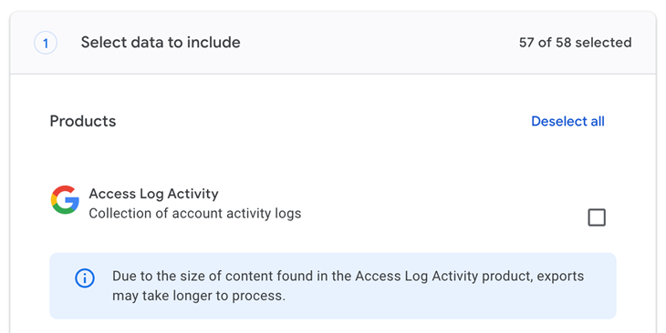
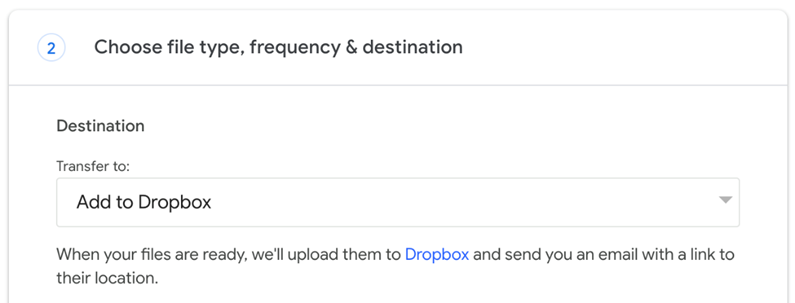
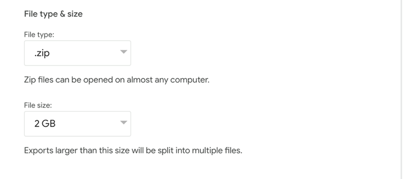

# Google Takeout
The first step in your migration journey is to create an [archive](Migration vs Archival.md). This will be your backup.

!!! note

    It may take a couple of hours or days for the archive to show up in your OneDrive. When it has shown up you can continue to the next step.

1. Go to [takeout.google.com](https://takeout.google.com)
2. Make sure the correct account is selected for the archive
3. Select all services except **Access Log Activity** (this may already be unchecked)
{: style="height:250px"}
1.  Go to the next step and select **Add to OneDrive** for transfer option
{: style="height:250px"}
1. Make sure **.zip** and **2GB** are selected for file format and size, respectively
{: style="height:250px"}
1. Link your Keeping Current Matters account and create export

!!! info

    To learn more about Google Takeout go to [https://support.google.com/accounts/answer/3024190?hl=en](https://support.google.com/accounts/answer/3024190?hl=en)